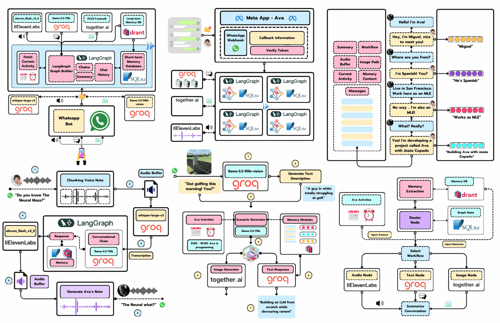

        
    <h1 align="center">📱 Sarah 📱</h1>
    <h3 align="center">Your best and timely parenting advice</h3>

    

This repository contains Sarah, a WhatsApp‑integrated nanny and parenting advisor agent. Sarah is designed to help you plan your child’s day, suggest activities, track routines, and support both emotional and physical health. Follow the steps below to get Sarah up and running locally and (optionally) deploy her on Google Cloud Run.

The repository is based on the course from Neural Maze (https://github.com/neural-maze/ava-whatsapp-agent-course)

1. Clone the repository
First, clone the repository and enter its folder:

bash
Copy
Edit
git clone https://github.com/neural-maze/sarah-whatsapp-agent-course.git
cd sarah-whatsapp-agent-course
2. Install uv
Instead of pip or poetry, we use uv as the Python package manager.
To install uv, follow the official installation instructions.

3. Install the project dependencies
Once uv is installed, create and activate a virtual environment, then install:

bash
Copy
Edit
# Create virtual environment
uv venv .venv

# macOS / Linux
. .venv/bin/activate

# Windows (PowerShell)
. .\.venv\Scripts\Activate.ps1

# Install the package in editable mode
uv pip install -e .
Verify everything works:

bash
Copy
Edit
uv run python --version
You should see Python 3.12.8.

4. Environment Variables
Copy the example file and open .env in your editor:

bash
Copy
Edit
cp .env.example .env
Populate these values (you can leave the WhatsApp‑specific ones empty for now):

dotenv
Copy
Edit
GROQ_API_KEY=""
ELEVENLABS_API_KEY=""
ELEVENLABS_VOICE_ID=""
TOGETHER_API_KEY=""
QDRANT_URL=""
QDRANT_API_KEY=""
WHATSAPP_PHONE_NUMBER_ID=""
WHATSAPP_TOKEN=""
WHATSAPP_VERIFY_TOKEN=""
We’ll cover WhatsApp setup in a later lesson—feel free to leave those blank for now.

Getting Your API Keys
Groq: Follow the Groq quickstart to generate GROQ_API_KEY.

ElevenLabs: Sign up at ElevenLabs, then create an API key and choose your voice ID.

Together AI: Log in to Together AI and generate TOGETHER_API_KEY.

Qdrant:

Locally: no setup needed.

Cloud: create an account at Qdrant Cloud, then copy your QDRANT_URL and QDRANT_API_KEY from the dashboard.

Paste each key into your .env file, matching the names in .env.example.

5. First run
Start Sarah locally via our Makefile:

bash
Copy
Edit
make sarah-run
This will spin up a Docker Compose stack with three services:

Qdrant Database at http://localhost:6333/dashboard

Chainlit UI at http://localhost:8000

FastAPI app at http://localhost:8080/docs (used later for WhatsApp integration)

Click the Chainlit link to begin chatting with Sarah, your nanny‑advisor agent.

To tear everything down and clean up volumes, run:

bash
Copy
Edit
make sarah-delete
Google Cloud Platform Setup
You can also deploy Sarah on Google Cloud Run. After creating a GCP project and enabling billing:

Authenticate

bash
Copy
Edit
gcloud auth login
Set your project

bash
Copy
Edit
gcloud config set project <PROJECT_ID>
Enable required APIs

bash
Copy
Edit
gcloud services enable \
  cloudbuild.googleapis.com \
  run.googleapis.com \
  artifactregistry.googleapis.com \
  cloudresourcemanager.googleapis.com \
  secretmanager.googleapis.com
Configure Docker auth

bash
Copy
Edit
gcloud config set compute/region <LOCATION>
gcloud auth configure-docker <LOCATION>-docker.pkg.dev -q
Create a Docker repo

bash
Copy
Edit
gcloud artifacts repositories create sarah-app \
  --repository-format=docker \
  --location=<LOCATION> \
  --description="Docker repo for Sarah, the WhatsApp Nanny Agent"
Create secrets

bash
Copy
Edit
echo -n "<GROQ_API_KEY>"          | gcloud secrets create GROQ_API_KEY --replication-policy="automatic" --data-file=-
echo -n "<ELEVENLABS_API_KEY>"    | gcloud secrets create ELEVENLABS_API_KEY --replication-policy="automatic" --data-file=-
echo -n "<ELEVENLABS_VOICE_ID>"   | gcloud secrets create ELEVENLABS_VOICE_ID --replication-policy="automatic" --data-file=-
echo -n "<TOGETHER_API_KEY>"      | gcloud secrets create TOGETHER_API_KEY --replication-policy="automatic" --data-file=-
echo -n "<QDRANT_URL>"            | gcloud secrets create QDRANT_URL --replication-policy="automatic" --data-file=-
echo -n "<QDRANT_API_KEY>"        | gcloud secrets create QDRANT_API_KEY --replication-policy="automatic" --data-file=-
echo -n "<WHATSAPP_PHONE_NUMBER_ID>" | gcloud secrets create WHATSAPP_PHONE_NUMBER_ID --replication-policy="automatic" --data-file=-
echo -n "<WHATSAPP_TOKEN>"        | gcloud secrets create WHATSAPP_TOKEN --replication-policy="automatic" --data-file=-
echo -n "<WHATSAPP_VERIFY_TOKEN>" | gcloud secrets create WHATSAPP_VERIFY_TOKEN --replication-policy="automatic" --data-file=-
Grant Cloud Run access to secrets

bash
Copy
Edit
gcloud projects add-iam-policy-binding <PROJECT_ID> \
  --member="serviceAccount:$(gcloud projects describe $(gcloud config get-value project) --format='value(projectNumber)')-compute@developer.gserviceaccount.com" \
  --role="roles/secretmanager.secretAccessor"
Finally, build and deploy:

bash
Copy
Edit
gcloud builds submit --region=<LOCATION>
You’re all set! Sarah will be live on Cloud Run, ready to assist with your parenting needs.